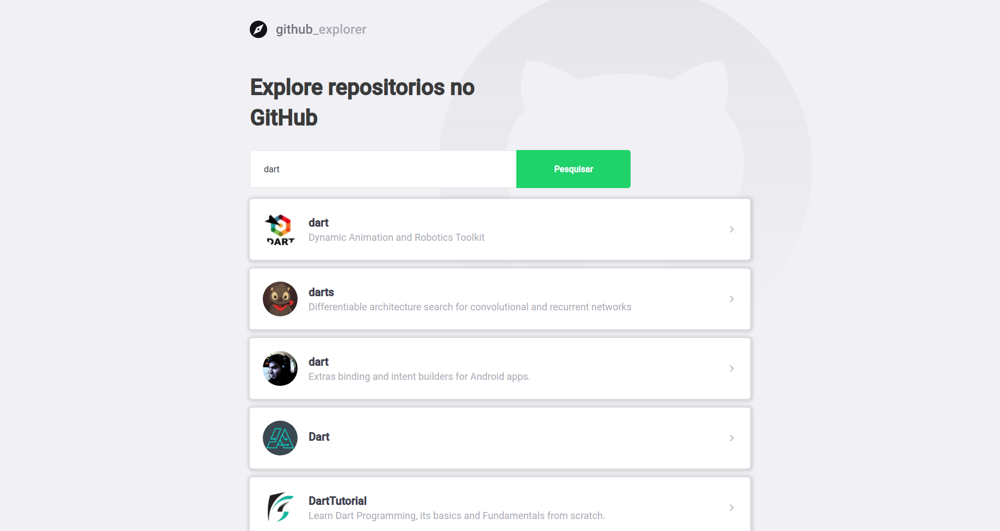
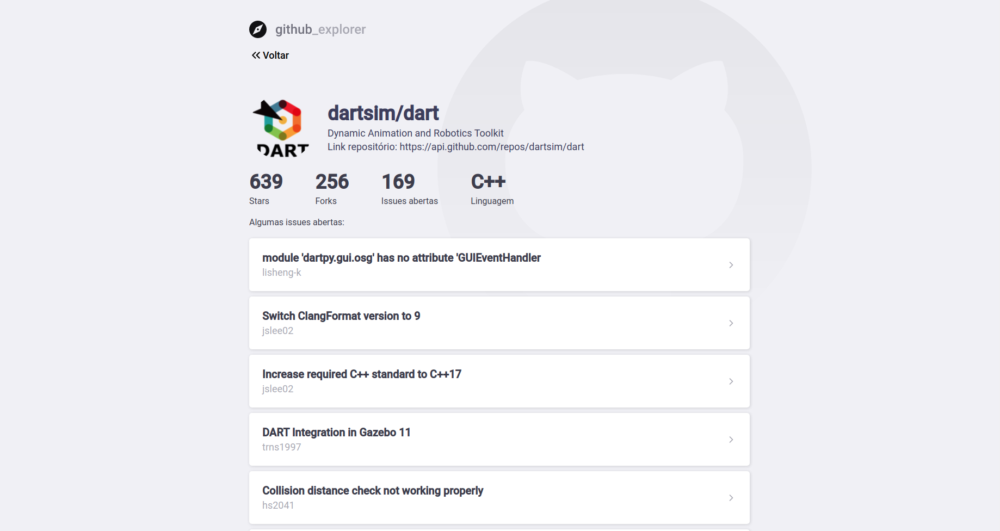
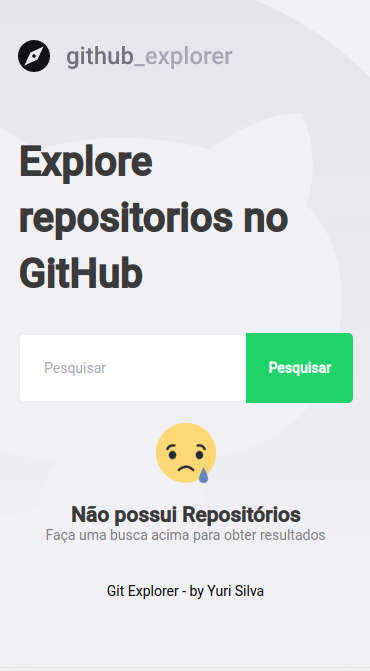
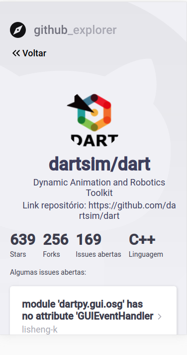

<h1>Git Explorer</h1>

Site for access: https://git-explorer-repos.netlify.app/

<h3>Clone project</h3>

````
git clone https://github.com/Yuri-Tiofilo/list-repos-github.git
````

<h3>Install Dependencies</h3>

````
yarn install
````

<h3>Add file .env</h3>

````
PORT=3001

REACT_APP_BASE_URL=https://api.github.com
REACT_APP_FRONTEND_URL=http://localhost:3001
````

<h3>Start Application</h3>

````
yarn dev
````

<h3>Design Of Application</h3>






<strong>Thanks</strong>
